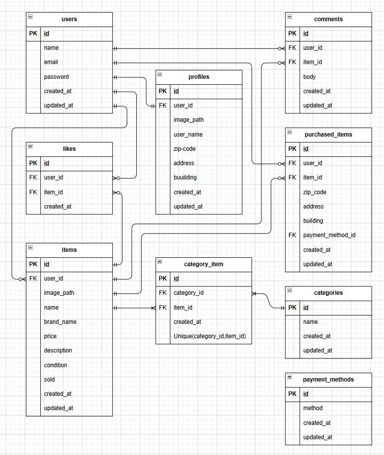

# coachtechフリマ(フリマアプリ)
## プロジェクト概要
本アプリは、Laravelフレームワークを使用し作成したテスト用のフリマアプリです。  

### 主な機能
- 商品の出品・購入
- 商品検索
- いいね・コメント機能
- 商品・マイリストの一覧表示（トップページ）
- 出品・購入商品の一覧表示（マイページ）

### 【重要】購入処理について 
支払い方法は、コンビニ払いとカード支払いのシミュレーションが可能です。  
以下の点に注意してください。 
- 実際に支払いは行われません。
- コンビニ払いは、データベースの保存処理のみになります。
- Stripeの本番キーは絶対にコミットしないでください。  
- カード支払いは、Stripe決済機能を、サンドボックス（テスト環境）でのみの動作を前提として、使用しております。
- 本アプリでのStripe使用の場合  
サンドボックス（テスト環境）で使用してください。  
必ずテスト用のキーを使用してください。  

## 環境構築

### Dockerビルド
1. `git clone git@github.com:kooooooota/flea-market.git`

2. DockerDesktopアプリを立ち上げる

3. `docker-compose up -d --build`

### Laravel環境構築
1. `docker-compose exec php bash`

2. `composer install`

3. 「.env.example」ファイルを複製し、「.env」ファイルを作成する。  
```bash
    cp .env.example .env
```

4. .envに以下の環境変数を追加 
```text 
    DB_CONNECTION=mysql  
    DB_HOST=mysql  
    DB_PORT=3306  
    DB_DATABASE=laravel_db  
    DB_USERNAME=laravel_user  
    DB_PASSWORD=laravel_pass  
```

5. アプリケーションキーの作成  
```bash
    php artisan key:generate  
```

6. マイグレーションの実行  
```bash
    php artisan migrate
```

7. シーディングの実行  
```bash
    php artisan db:seed  
```

### Stripeの環境変数の設定・カード決済画面での入力事項
1. Stripeアカウントの準備  
Stripeにログインまたはアカウント作成し、テストモード（サンドボックス）にする。  

2. APIキーの取得  
Stripeダッシュボードの開発者からAPIキーを選択し、以下2つを取得する。  
※必ず、テスト用のキーを使用してください。
- 公開可能キー（pk_test...で始まる文字列）
- シークレットキー（sk_test...で始まる文字列）  

3. .envファイルへの追記
.envファイルに取得したキーを貼り付ける。  
```bash
STRIPE_KEY=pk_test...取得した公開キー
STRIPE_SECRET=sk_test...取得したシークレットキー
```  

4. カード決済画面での入力事項  
- カード番号: 4242 4242 4242 4242  
- 有効期限: 未来の年月  
- 他は任意の値を入力する。


## テスト実行方法
1. 「.env.testing.example」ファイルを複製し、「.env.testing」ファイルを作成する。  
```bash
    cp .env.testing.example .env.testing
```

2. 「.env.testing」ファイルのAPP_ENVとAPP_KEYを編集する。 
```text 
    APP_ENV=test
    APP_KEY=
```

3. 「.env.testing」ファイルのデータベースの接続情報を編集する。  
```text
    DB_DATABASE=demo_test
    DB_USERNAME=root
    DB_PASSWORD=root
```

4. APP_KEYに新たにテスト用のアプリケーションキーを加える。
```bash
    php artisan key:generate --env=testing
```

5. キャッシュのクリアをする。
```bash
    php artisan config:clear
```

6. テスト用のテーブルを作成する。
```bash
    php artisan migrate --env=testing
```

7. テスト実行  
- 全テスト実行: `vendor/bin/phpunit tests/Feature`  
- 特定のテスト: `vendor/bin/phpunit tests/Feature/テストファイル名`

## 使用技術(実行環境)
- PHP8.3.0
- Laravel8.83.27
- MySQL8.0.26
- nginx1.21.1
- Mailhog
- Stripe

## ER図


## URL
- 開発環境：http://localhost/
- phpMyAdmin:：http://localhost:8080/
